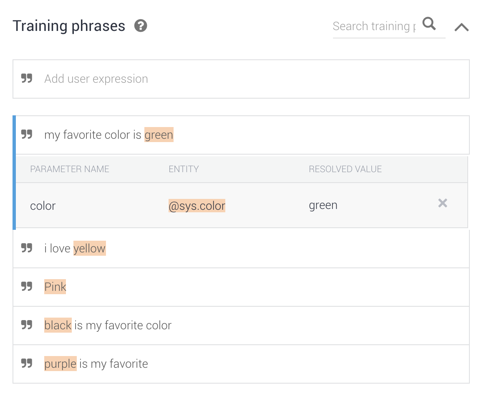
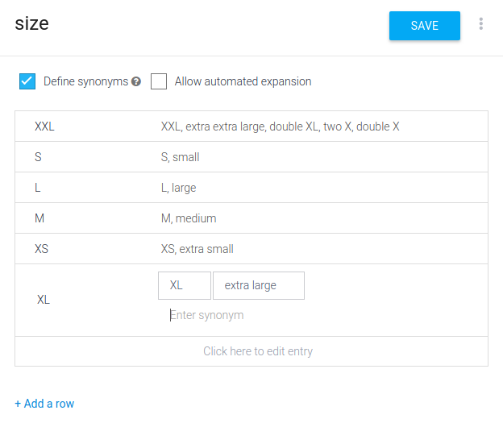

# Building Conversational Interfaces with Dialogflow

Ever since Siri became a standard feature on iOS, voice commands and conversational interfaces have gone through a renaissance of sorts, finally passing a threshold from gimmicky tech demos or science fiction to actual usability. They started out rough at first, being little more than voice command runners, but soon after they became fully conversational - that is, able to understand natural language instead of voice commands, able to ask follow-up questions.

Finally, they developed something of a personality, making them more human-sounding - done initially by adding self-aware sounding responses, often referencing Asimov's philosophical work on AIs or Turing's work on discerning an AI from a real person.

-- more --

Conversational interfaces have been an area of research for decades now, going back to the mid 60's with text-based interfaces and chatbots. An example of early conversational interfaces is [STUDENT](https://en.wikipedia.org/wiki/STUDENT_(computer_program)), which was developed in 1964, eight years after John McCarthy coined the term Artificial Intelligence. Another example is [ELIZA](https://en.wikipedia.org/wiki/ELIZA), which simulated conversation by using a pattern matching and substitution methodology; it had no actual framework for contextualizing events, nor a database of real-world knowledge. One script it ran was used as a simple form of psychotherapy, by asking the user certain questions to make them "open up", often referencing the previous line the user mentioned. This was one of the first bots to have a shot at the Turing test.

Work on natural language processing and AI continued over the decades. One of the most important milestones for today's conversational interfaces was IBM's Watson, which can answer questions posed in natural language. It famously won a game of Jeopardy in 2011.

The first conversational interface to see widespread adoption was of course Apple's Siri, which was originally released as an app for iOS in February 2010, then acquired by Apple just two months later. It uses a speech recognition engine provided by [Nuance Communications](https://en.wikipedia.org/wiki/Nuance_Communications). (As an aside, that same text-to-speech technology was actually used by a POC done by a colleague of mine while I was working for Dutch Railways, eventually [presenting it at Strangeloop 2012](https://www.infoq.com/presentations/Voice-Mobile)).

Microsoft followed in 2013 with [Cortana](https://www.microsoft.com/en-us/cortana), a personal digital assistant named after the synthetic intelligence in the Halo games. It was integrated into Windows 10 in 2015 after Microsoft failed to get a foothold in the mobile market. Not long after, Amazon introduced [Alexa](https://www.amazon.com/Amazon-Echo-And-Alexa-Devices/b?node=9818047011), which took Siri's concept of a personal voice assistant and made it a permanent household assistant constantly listening for an activation command.

Finally, Google followed suit with [Google Assistant](https://assistant.google.com) in 2016, as a follow-up or replacement of their Google Now offering. It was (most likely) based on the Assistant app by Speaktoit, which was taken over not long before Google introduced their Assistant and Google Home offering.

Speaktoit opened up their natural language processing engine to third-party developers in 2014, branded as [API.AI](https://api.ai). Their engine was agnostic in that it could be used to create conversational interfaces for a wide range of services and chat applications. In 2017, a year or so after Google bought the company, API.AI was rebranded to [Dialogflow](https://dialogflow.com/), its marketing focused towards building Actions for the Google assistant.

---

We have worked with Dialogflow recently to help our customers integrate with this new form of user interaction; most of this post will focus on building conversational interfaces using Dialogflow, however there are some competing alternatives which we'll go into in short later in this post.

## Dialogflow

Dialogflow is Google's product to build conversational, natural language interactions with. Combined with Google's text-to-speech technology, it allows for both voice controlled and text controlled interfaces, and it can be operated from a wide range of products, from Slack or Messenger bots to Google Home smart speakers and displays, and you can even build your own assistant using e.g. a Raspberry Pi or your own apps with it.

Despite it now mainly focusing on Google Assistant, Dialogflow also supports Cortana and Alexa, allowing developers to build their interface for all major voice assistant platforms.

## Building interfaces with Dialogflow

It's probably best to [follow the official documentation and tutorials](https://dialogflow.com/docs), but in this section we'll try to give a bird's eye view of how to create a conversational interface - also known as an Agent - with Dialogflow.

### Intents

The base unit of a conversational interface in Dialogflow is called an [Intent](https://dialogflow.com/docs/intents). In a nutshell, an Intent is a unit of a conversation that is triggered by a certain phrase the user inputs. This can be a command ("Turn on the living room lights", "Call my mom", "Play Despacito"), a question ("What are my appointments today?", "What is the speed of light?", "What is the first law of robotics?"), or a response to a question asked by the Agent ("Blue", "Yes", "Next Saturday").

An Intent needs a number of Training Phrases to be programmed, a set of words, phrases or sentences that both act as a trigger for the intent, and a training set for the Agent to be trained with. The key feature here is that if you program it with just a handful of Training Phrases, the Dialogflow agent will become smart enough to recognise variations of the phrases to trigger the Intent. The default Welcome intent, used to start talking to the bot, is programmed with phrases like "hi", "hello" and "greetings", but will also be triggered when saying "yo".

When programming an Intent to get specific user input - that is, what the user is asking for or providing - Dialogflow has a smart way to recognise and extract that input. In a phrase like "Please play Despacito", the entire phrase triggers the Intent, but Dialogflow needs to extract the key word - Despacito - in order for the Fulfillment to be able to retrieve the correct song to play.

## Entities

This key word is known as an [Entity](https://dialogflow.com/docs/entities) in Dialogflow. By default, there are a number of built-in Entities, known as System Entities. These are for example numbers, dates, durations, locations, genres, flight numbers, etc. When defining your Intent's Training Phrases, Dialogflow will automatically start highlighting System Entities it recognises already. If it doesn't automatically recognise the entitiy, you can double-click it and tell Dialogflow to interpret that phrase as one of its builtin system entities.

Entity detection is a bit fuzzy; sometimes it's magic enough that it recognizes "Next Sunday" as (e.g.) October 21st, but other times it just doesn't seem to pick it up. Adding more training phrases with unrecognized entities and telling Dialogflow how to interpret them will help, both in the short run with your specific Agent, but also in the long run because every Intent, every Entity and every conversation you and your users have with the Agent add to the training set that Google's engineers can use to improve their software.

In addition to system entities, you can define custom entities for arguments not covered by the system entities, called Developer Entities. Examples are for example clothing sizes, foods, car brands, etc. By default, developer entities have a strict match - that is, they only match the keyword itself or the synonyms you explicitly define. However, using a checkbox you can tell Dialogflow to automatically expand the entities - the example given [in the documentation](https://dialogflow.com/docs/entities/create-manage-entities) is that of food products. Educate the Agent with words like "bread", "butter" and "milk", and it'll expand to include "vegetables" as a matching entity.

Finally, you can create session-specific entities, which are only valid for the duration of the current conversation - the example given is time-sensitive booking options, although those could probably be handled by system entities for date and time as well.

## Contexts

By default, a Dialogflow agent will "listen" to all Intents at the same time, invoking the Intent that most closely matches the user's input. However, this will quickly cause the wrong Intent to be triggered, especially if the Agent expects similar-sounding input in different stages of the conversation (such as when it asks for a date).

To solve this, Intents can be configured with [Contexts](https://dialogflow.com/docs/contexts), which are in the form of Input and Output contexts. An Output Context is like setting a flag when an Intent has been triggered, much like a current status. When defining an output context, the developer can set an Expiry, which indicates after how many conversation steps the Context is no longer valid. An example is that you set a "listening to departure date input" context after an Intent's response asks "When would you like to go?"

Next, in a generic "date receiving" Intent, the handler for that Intent can see which context is active - departure date or arrival date. This is then known as an Input Context.

When configuring an Intent with an Input Context in the Dialogflow interface, what basically happens is that the Agent does not listen for that particular Intent in the user's phrasing until the Input Context is set to active. That is, it doesn't even listen for date input until one of the two date input Contexts is active. This is the primary approach to handling different phases in a conversation.

## Fulfilment

When creating an Intent, there are two options for the handling of it; either have the Agent reply, optionally replying with the input the user gave, or implement a fully custom [Fulfillment](https://dialogflow.com/docs/fulfillment) via a web hook.

When configuring a web hook, Dialogflow will call the web hook you configure with a HTTP POST request containing a JSON body. This JSON document contains information about the input, the contexts, and (for the developer's convenience), any extracted Entities, normalized to a common format (e.g. an ISO date for October 21st when the user's phrase said "Next Sunday").

The webhook gets the document and returns another JSON body, telling Dialogflow how to respond, which output contexts to set, which selectable options to show to the user, etc.

There are two major libraries to make implementing Dialog webhooks easier; there's the [Dialogflow fulfillment library](https://github.com/dialogflow/dialogflow-fulfillment-nodejs) for NodeJS, and the [Actions on Google library](https://github.com/actions-on-google/actions-on-google-nodejs) for NodeJS, which seems very similar to the Dialogflow fulfilment library but adds functionality for Firebase Functions, the Google Actions SDK, and smart home functionality.

Webhooks are ideal use cases to be deployed in lambdas; Google highlights Firebase Functions, but these can just as easily be deployed in Google Cloud Functions, AWS Lambda, Azure Cloud Functions, etcetera. Of course, it can also be deployed as a regular application. A lambda is still recommended though; every time the webhook is called, every important state (if any) is passed to the function so the hook does not need to retain any state. Finally, lambdas allow for pretty much infinite horizontal scaling, so your Agent can handle anywhere between single to millions of conversations at a time, the only constraint being how much you are willing to pay for it.

Speaking of pricing, there are two costs to keep in mind; [Dialogflow pricing](https://dialogflow.com/pricing), where cost is calculated per request, per 15 seconds of audio and per minute of phone call processed. Note that some of these features are still marked as beta. In addition, when implementing your own webhook you'll need to keep the costs for running the [Firebase Function](https://firebase.google.com/pricing/) or lambda in mind. Different lambda providers will have different pricing, so compare the runners depending on your requirements. Also, different implementations or implementation languages may have different performance characteristics, and thus different lambda pricing.

## Personal experiences

I've been working on some proof of concepts myself for the past couple of days to get a feel for conversational interfaces. It was a bit of a rough start at first; I came in via Actions on Google. If you follow that tutorial, it takes you from Google's Actions console to the Dialogflow console and to Firebase Functions, at least three different services, each with their own language and getting to grips with it all is a bit intimidating at first. If you'd like to get started with this technology, I think going in through the [Dialogflow documentation](https://dialogflow.com/docs) would be a smoother ride, also because it introduces the most important concepts more gradually.

The Dialogflow user interface, as well as the flow to create an Agent, might need some work to make it a much more smooth experience. I found it a bit annoying to have to switch between Dialogflow for managing Intents, Training Phrases and Entities, and back to the NodeJS webhook to process responses. What I also wasn't able to figure out is how to make Dialogflow leading in their responses; that is, the responses and follow-up questions that the Agent was doing ended up all coming from the webhook, instead of the somewhat more user friendly Dialogflow UI.

I believe designing conversational interfaces, and later on making them accessible in multiple languages, is a huge effort for multiple disciplines. It would be ideal if the text and speech part, that is, questions, responses, entities, follow-up questions, training phrases etc could all be handled in the UI, while software-based handling is done in code. Right now it's a mix of both, which probably will not scale easily.

Alternatively, make it a full developer experience, where intents, contexts, training phrases etcetera are all handled in code.

Most tutorials and documentation is about the NodeJS interface, but Google has [a number of Dialogflow libraries in other programming languages](https://cloud.google.com/dialogflow-enterprise/docs/reference/libraries/overview); these all seem part of the Google Cloud Client Libraries though, so they might be a bit unfocused or hard to use. The Node libraries should be good enough for most use cases; if not, building your own api or branching one off of the Cloud Client Libraries shouldn't be too big of an issue, the webhook rest/json API is well documented and not too complicated.

I've only spent time on Dialogflow and Actions on Google so far, but besides Google there are a number of other major parties on the market, each of which should be assessed independently.

## Alternatives

There are at least two other major voice assistant providers; Amazon and Microsoft. Building what Microsoft calls a [Cortana Skill](https://docs.microsoft.com/en-us/cortana/skills/) is more of a programming exercise than it is with Dialogflow, where the developer can use the Bot Framework to develop a speech bot in C# or Javascript.

More interesting seems to be [Amazon Lex](https://aws.amazon.com/lex/), a service for making conversational interfaces powered by the same technology behind Alexa. One of the use cases they highlight on their landing page is similar to what Google is working on, that is, call center bots. I haven't been able to look into Lex in detail yet so I don't know what the developer or customer experience is like yet, but it too is potentially a big player on this new market.

## The Near Future

Google Assistant and Dialogflow are only the beginning for Google's plans with regards to natural language processing and conversational interfaces. So far, we've gone from voice commands - which is what e.g. Siri started out as - to conversational interfaces. These are more natural, and allow for a wider range of functionality (such as booking a flight or ordering food), but they still are and feel like you're talking back and forth with a robot.

The next steps are already in beta and are already being demoed by for example Google. One technology they're working on is the [Contact Center AI](https://cloud.google.com/solutions/contact-center/), allowing implementers to build a Virtual Contact Center Agent in Dialogflow to help them take load off the human agents for common questions or for the initial contact - getting user details and the category of their issue would already be a great step forward. It would replace the current phone dial menus with a more natural and faster alternative.

Second, note the use of the word Contact Center, instead of Call Center - we live in an age where in addition to a call center, people reach out to companies via direct messaging, Twitter, text messages, etcetera. With this tool, a company can implement an agent that can operate the same customer support flow over multiple channels. It could (but I'm hypothesizing here) even remove the need for a human to speak directly to the customer, instead allowing the human agent to do their work in pure text while the virtual agent replies to the user in speech. This would probably be too much of a delay, since vocal communication needs to be in real time.

An additional technology Google is working on is trying to make the interactions with a conversational agent more human sounding. At Google I/O 2018, Google showcased [Google Duplex](https://ai.googleblog.com/2018/05/duplex-ai-system-for-natural-conversation.html), what looks like an advanced version of their conversational interface mixed with the next generation of text-to-speech engines, adding little details to spoken computer text to make them sound more human, and improving the speech-to-text going the other way to be able to understand low quality (phone), colloquial language better, instead of the more command and input like structure of today.

https://www.youtube.com/watch?v=bd1mEm2Fy08

The combination of Dialogflow, Contact Center AI and Duplex has a huge potential to, within the next year or so, transform contact centers around the world. Combine it with Google's Translate service and international consolidation of customer support will become a reality. Microsoft and other companies showcased realtime speech to translated speech engines, allowing people that don't speak the same language to be able to have a conversation. Applying this to customer support will be a huge step for a lot of companies.

Interested in building your own assistant? Xebia is [offering a (free!) Google Assistant for Your Business workshop](https://pages.xebia.com/workshop-google-assistant), at a date and location of your choosing; the workshop takes about two hours, and by joining you automatically get a chance to win a free Google Home smart speaker.

